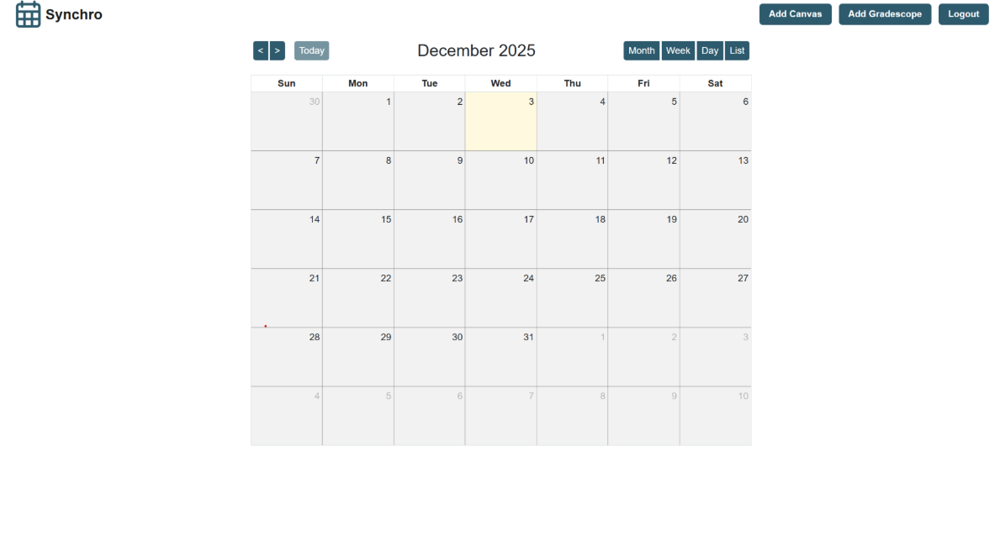

# Overview

Synchro is a web application that automatically compiles all of a student’s assignment deadlines from multiple academic platforms — such as Canvas and Gradescope — into a single, unified calendar view.

Students can then export their personalized calendar as an .ics file, a standard format supported by calendar apps like Google Calendar, Outlook, and Apple Calendar. “An .ics file is a standard, plain-text file format for sharing calendar events between different applications.” — Google AI Overview

## Features

- Automatically fetch and interpret due dates from sites like Canvas, Gradescope, and Campuswire

- Create a web interface to display all the user’s due dates in one calendar

- Notify the user when a due date is approaching

- Allow exporting due dates to Google Calendar, Microsoft Outlook, Apple Calendar App (or any calendar of user’s choice) accurately with details

## Tech Stack

- Frontend: React + Typescript

- Backend: Flask + Python

- Data Storage: MongoDB

- Calendar Library: FullCalendar.js

## Getting Started

Clone the Repo: 
- git clone https://github.com/jamespineiro/cs320-team-a-ardvark-.git 
- cd cs320-team-a-ardvark

Set up a .env file:
- Steps for how to do this are listed in the backend README file

Install Dependencies:
- npm install 
- nvm use 20 (only do this if you have the wrong node version)

Start the Development Server:
- npm start

Access the App:
- Open http://localhost:5173 in your browser

## Example Workflow

1. User signs in and connects their Canvas and Gradescope accounts.

2. The app retrieves upcoming deadlines using each platform’s API.

3. Deadlines are merged and displayed in a unified calendar view on the app.

4. User clicks “Export Calendar” → downloads an .ics file.

## Screenshots

### Launch Page

### Login/Sign Up Page

### Home Page

## Contributors

Team Aardvark
(James Pineiro, Nicholas Carlone, Keerthi Chebrolu, Arnav Gupta, Johan Lakshmanan, Tory Leone, Vidhita Mittal)

## License

This project is licensed under the [MIT License](./LICENSE).

