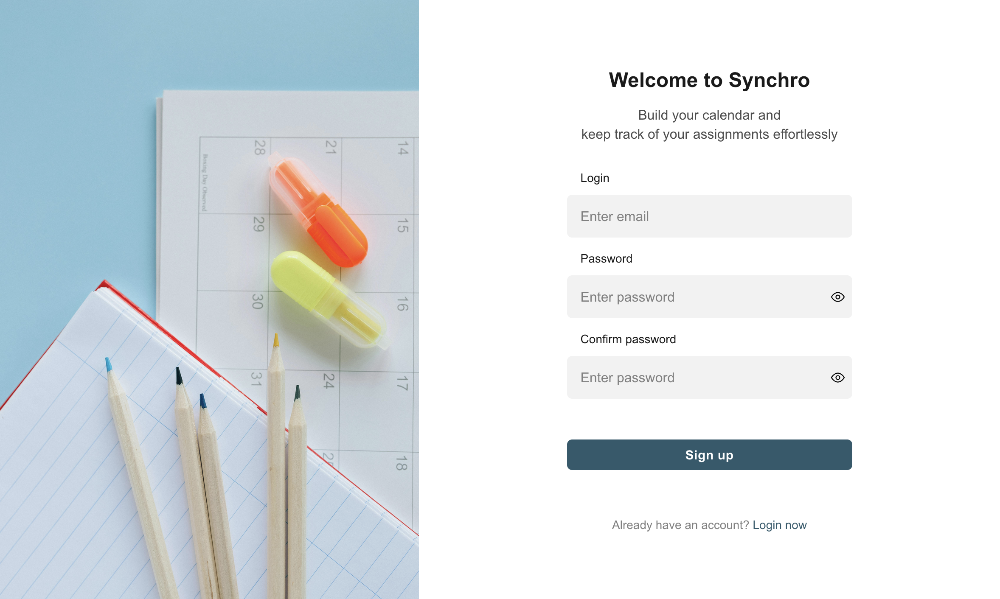
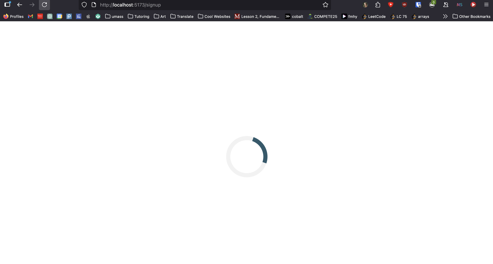
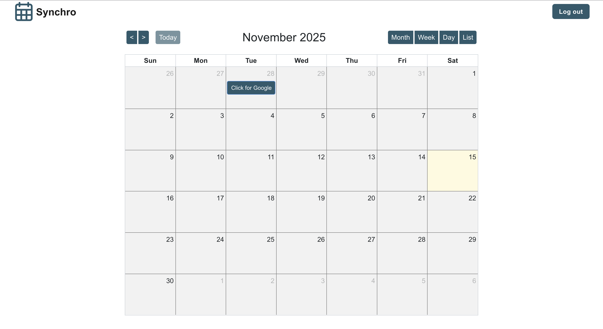

# Overview

This is the frontend of the Synchro web application.
The app provides students with a unified calendar that displays all assignment deadlines pulled from multiple academic platforms (e.g., Canvas, Gradescope).

Students can view, filter, and export their deadlines as an .ics file for use with Google Calendar, Outlook, or Apple Calendar.

## Features

- Interactive Calendar View using FullCalendar

- Backend Integration via REST API

- ICS File Export button for exporting to external calendars

- Responsive Design using Bootstrap 5

- Reusable Components documented with Storybook

- Client-side Routing via React Router

## Tech Stack

- Framework -	React + TypeScript
- Build Tool - Vite, https://vitejs.dev/
- Calendar Component - FullCalendar, https://fullcalendar.io/
- Routing	- React Router DOM v7
- UI Styling - Bootstrap 5 + Bootstrap Icons
- Linting	- ESLint + TypeScript ESLint
- UI Documentation - Storybook
- Testing	- Vitest + Playwright (browser testing)

## Set Up and Installation

Navigate to the frontend folder

- cd frontend

Install dependencies

- npm install

Configure environment variables

// Create a .env file in the frontend directory with the following keys (adjust as needed):

- VITE_API_BASE_URL=http://localhost:3000/api

// This URL should point to your backend server’s API root.

Run the development server

- npm run dev
- Then open http://localhost:5173 in your browser.

Link for each page
- http://localhost:5173/login
- http://localhost:5173/signup
- http://localhost:5173/home

## Available Scripts

- npm run dev - Start the local development server (Vite)
- npm run build - Build the production-ready app (TypeScript + Vite)
- npm run preview - Preview the production build locally
- npm run lint - Run ESLint for static code analysis
- npm run storybook - Launch Storybook on port 6006 to view isolated UI components
- npm run build-storybook - Build a static Storybook site for documentation/testing

## Screenshots

### Login Page

### Sign Up Page

### Loading Page

### Home Page

## Contributors

Team Aardvark
(James Pineiro, Nicholas Carlone, Keerthi Chebrolu, Arnav Gupta, Johan Lakshmanan, Tory Leone, Vidhita Mittal)

## License

This project is licensed under the [MIT License](./LICENSE).